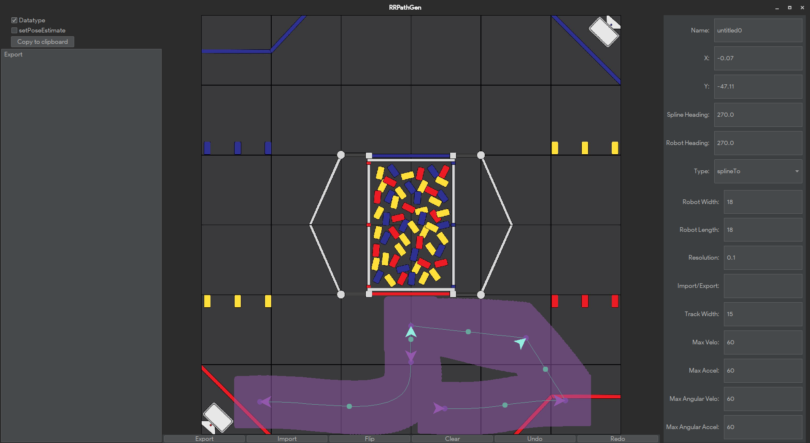

# RRPathGen

RRPathGen is a tool to generate [Road Runner](https://github.com/acmerobotics/road-runner) v0.5 paths.

## Installation (Jar)

1. Download the jar from the [releases page](https://github.com/Jarhead20/RRPathGen/releases).
2. Check that you have at least java 8 installed `java --version`
3. Run the jar either by double clicking it or through the command line with `java -jar RRPathGen-X.X.X.jar`

## Installation (Intellij)

1. Clone the repo `git clone https://github.com/Jarhead20/RRPathGen.git`
2. Setup a run configuration
3. Run the app

## Usage

Generate your paths using the key binds below and once you are done export the path with the export button and copy paste it into your autonomous program.

| Key Bind                 | Action                  |
|--------------------------|-------------------------|
| Left Click               | Add New Point           |
| Left Drag (Point)        | Drags Selected Point    |
| Alt(Option) + Left Click | Change End Tangent      |
| Shift + Alt(Option) + Left Click | Change Robot Heading    |
| Left Arrow               | Next Path               |
| Right Arrow              | Previous Path           |
| R                        | Reverse Robot Direction |
| Delete / Backspace       | Delete Selected Node    |
| Ctrl + Z                 | Undo Previous Action    |
| Ctrl Drag (Point)        | Snapping Rotations      |

If you accidentally do something wrong with the config, just delete it at `%appdata%/RRPathGen` for Windows, `~/Library/Application Support/RRPathGen/config.properties` for MacOS and `~/.RRPathGen/config.properties` for Linux.

## Acknowledgements
The inspiration from this project came from Technic Bots' [Blitz](https://technicbots.com/Blitz) app. 
The field images were aquired from [Team Juice 16236](https://www.reddit.com/r/FTC/comments/1fbhxka/into_the_deep_meepmeep_custom_field_images/). 
And a big thank you to [Ryan Brott](https://github.com/rbrott) for helping me with the spline implementation.

## Contributing
Pull requests are welcome. For major changes, please open an issue first to discuss what you would like to change.

## License
[MIT](https://choosealicense.com/licenses/mit/)